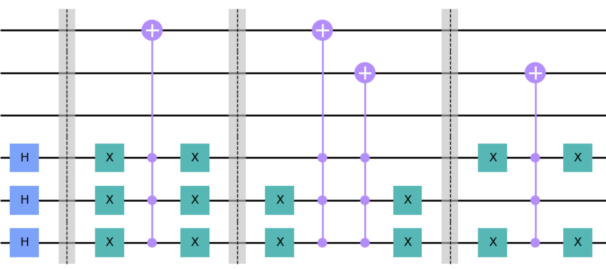

<div align="center">
  
# Quantum Audio


   [](https://github.com/moth-quantum/quantum-audio/blob/pre-release-docs/LICENSE) [](https://doi.org/)

An open-source Python package for building Quantum Representations of Digital Audio using _Qiskit_ circuits.

<br>


</div>

## 💿 What is Quantum Audio ?

Audio plays a vital role in carrying information and music, traversing through domains — from analog and digital formats to engaging our senses in a profound way. With the advent of Quantum Computing, we formulate ways of representing Audio Information in the Quantum Domain, enabling new explorations in artistic and research contexts 💫

The Quantum Audio Package provides fundamental operations for representing audio as Quantum States that can be processed on a Quantum computer (or Simulator) and played back in the classical world 🔊

## 🗒️ Table of Contents

- [Overview](#overview)
- [Version Information](#version)
- [Installation](#installation)
- [Usage](#usage)
- [Additional Resources](#materials)
- [Contributing](#contributing)
- [Future Releases](#future-releases)
- [Citing](#citing)

## 🔍 Overview <a id="overview"></a>

Modulation Schemes are essential methods for encoding Audio in both Analog (such as **FM** 📻) and Digital (such as **PCM** 💻) formats. The same is extended for Quantum Audio.
The package contains different schemes to encode audio and necessary utilities as follows:

- ```schemes``` : Quantum Audio Representation Methods
  
| Acronym | Representation Name | Original Reference |
|---------|---------------------|--------------------|
| **QPAM**    | Quantum Probability Amplitude Modulation | Real-Ket          |
| **SQPAM**   | Single-Qubit Probability Amplitude Modulation | [FRQI](http://dx.doi.org/10.1007/s11128-010-0177-y)  |
| **MSQPAM**  | Multi-channel Single-Qubit Probability Amplitude Modulation | [PMQA](https://doi.org/10.1007/s11128-022-03435-7)  |
| **QSM**     | Quantum State Modulation | [FRQA](https://doi.org/10.1016/j.tcs.2017.12.025) |
| **MQSM**    | Multi-channel Quantum State Modulation | [QRMA](https://doi.org/10.1007/s11128-019-2317-3)  |

- ```utils``` : Common Utilary functions for data processing, analysis, circuit preparation, etc.

## 🧩 Version Information <a id="version"></a>

### Acknowledgment of Previous Version ```v0.0.2```
This project is derived from research output on Quantum Representations of Audio, carried by <b>Interdisciplinary Centre for Computer Music Research (ICCMR)</b>, University of Plymouth, UK, namely:

- Itaboraí, P.V., Miranda, E.R. (2022). Quantum Representations of Sound: From Mechanical Waves to Quantum Circuits. In: Miranda, E.R. (eds) Quantum Computer Music. Springer, Cham. https://doi.org/10.1007/978-3-031-13909-3_10
  
- Itaboraí, P. V. (2022). Quantumaudio Module (Version 0.0.2) [Computer software]. https://github.com/iccmr-quantum/quantumaudio
  
- Itaboraí, P. V. (2023) Towards Quantum Computing for Audio and Music Expression. Thesis. University of Plymouth. Available at: https://doi.org/10.24382/5119

### Key Changes in the Redeveloped Version ```v0.1.0```
This project has been completely redeveloped and is now maintained by <b>Moth Quantum</b>. https://mothquantum.com

- **New Architecture:**

  - This project has been restructured for better flexibility and scalability.
  - Instead of _QuantumAudio_ Instances, the package operates at the level of _Scheme_ Instances that perform encoding and decoding functions independent of the data.
    
- **Feature Updates:**
  
  - Introducing 2 Additional Schemes that can encode and decode Multi-channel Audio.
  - Supports Faster encoding and decoding of long audio files using Batch processing.
    
- **Dependency Change:**
  
  - Support for _Qiskit_ is updated from `v0.22` to `v0.46`
    
- **Improvements:**
  
  - Improved organisation of code for Readability and Modularity
  - Key Information of Original Audio is preserved at Encoding, making the Encoding and Decoding operations independent.
    
- **License Change:**
  
  - The License is updated from **MIT** to **Apache 2.0**

### Migration Guide
If you're transitioning from the previous version, please check the [Migration Guide](MIGRATION.md) for an overview of the package usability.


##  🪄 Installation <a id="installation"></a>
To install the Quantum Audio Package, you can use ```pip``` (which comes with Python) which installs it from [PyPI](https://pypi.org/project/quantumaudio/) package manager. Run the following command in Terminal or Command Prompt: 
```
pip install quantumaudio
```
For local installation by [cloning](https://docs.github.com/en/repositories/creating-and-managing-repositories/cloning-a-repository), navigate to the cloned directory in Terminal or Command Prompt and run:<br>
```pip install .``` or  ```pip install -r requirements.txt``` <br>

> [!Note]
 > When using `pip` commands to install packages and dependencies, it's recommended to use a **virtual environment** to keep them isolated from the system's Python. This will avoid dependency conflicts especially if you have _Qiskit_ version `1.0` or later installed. Instructions on using a virtual environment are provided [here](ENVIRONMENT.md).

### Optional Dependencies

#### **Digital Audio Dependencies**
  The core package operates with _numpy_ arrays. Dependencies for audio file handling to run audio examples in notebook and scripts in the repository can be additionally installed using `pip`:
  ```
  pip install quantumaudio[audio_io]
  ```
  For local installation from the cloned directory: ```pip install .[audio_io]``` or manually with ```pip install -r requirements-audio.txt```<br>

  > [!Tip]
 > If using your own choice of libraries for digital audio processing, please be aware that Multi-channel Quantum Audio is processed with _Channels First_ data structure. e.g. `(2, N)` for a Stereo Audio of `N` samples.

#### **Notebook Dependencies**
  The [Demo Notebook](DEMO.ipynb) features interactive elements that require additional dependencies. It can be installed using `pip`:
  ```
  pip install quantumaudio[notebook]
  ```
  For local installation from the cloned directory: ```pip install .[notebook]``` or manually with ```pip install -r requirements-notebook.txt``` <br>


## 🎨 Usage <a id="usage"></a>

Get started on creating Quantum Audio Representations with just a few lines of code.
```python
# An instance of a scheme can be created using:
import quantumaudio
qpam = quantumaudio.schemes.QPAM() # or simply quantumaudio.QPAM()

# Define an Input
original_data = [ ] # an array of samples

# Encoding
encoded_circuit = qpam.encode(original_data)

# ... optionally do some analysis or processing

# Decoding
decoded_data  = qpam.decode(encoded_circuit,shots=4000)    
```
> [!Note]
> The `encode` function returns a circuit with attached classical measurements by default. In Qiskit, it is not possible to directly modify a circuit after these measurements are added. If you wish to return a circuit without measurements, you can specify `measure=False` while encoding.

> [!Tip]
> The circuit depth can grow complex for a long array of samples which is the case with Digital Audio. It is optimal to represent a short length of samples per Circuit. The functions provided in `tools/stream.py` facilitate the processing of Long arrays in chunks. Examples of the usage can be found in the [Demo Notebook](DEMO.ipynb) and `scripts` provided in this repository.

### Running on Simulator

The default ```scheme.decode()``` uses local [_AerSimulator_](https://github.com/Qiskit/qiskit-aer) as the default backend. Internally, the function performs ```qiskit.execute()``` method similar to ```v0.0.2``` and a compatible backend object can be specified by passing the ```backend=``` parameter.

### Running on Quantum Hardware

The package allows flexible use of Quantum Hardware from different Providers for executing the circuits.

- If the result obtained from a Hardware follow the format of [qiskit.result.Result](https://docs.quantum.ibm.com/api/qiskit/qiskit.result.Result) object:
  - The audio can be decoded using ```scheme.decode_result(result_object)``` method. In this case, relevant metadata information is preserved and applied at decoding. 

- If the result is in form of a **Counts** dictionary or [qiskit.result.Counts](https://docs.quantum.ibm.com/api/qiskit/qiskit.result.Counts) object with keys representing classical measurement outcomes and values indicating the number of times the outcome was observed:
  - The audio can be decoded using ```scheme.reconstruct_data(counts)``` method. In this case, metadata information can be manually passed as arguments.
 
## 📘 Additional Resources <a id="materials"></a>
### Notebook Examples
For examples of circuit preparation, signals reconstruction, and interactive demonstrations, please check the [Demo Notebook](DEMO.ipynb). It combines the core package with useful functions from the `tools` folder to go through Visual and Digital Audio examples.

### Quick Export ⚡️
To quickly export quantumaudio from any audio file (e.g., mp3, ogg, flac, m4a), a script ```export.py``` is provided in the `scripts` folder. Navigate with `cd scripts` and run:
  ```bash
  python export.py -i path/to/input/audio/file
  ```
  ```console
  usage: export.py [-h] -i [-o] [-v] [--scheme] [--shots] [--sr] [--stereo] [--buffer_size]

  Process quantum audio and export as .wav file.

  options:
    -h, --help            show this help message and exit
    -i, --input           Path to the input audio file.
    -o, --output          Path to the output audio file. (default: saves in same directory with a prefix `qa_`)
    -v, --verbose         Enable verbose mode.
    --scheme              Quantum Audio Scheme (default: `qpam` for mono audio, `mqsm` for stereo audio).
    --shots               Number of shots for measurement (default: 8000)
    --sr                  Sample rate of Digital audio (default: 22050)
    --stereo              Enable stereo
    --buffer_size         Length of each audio chunk (default: 256)
  ```

> [!Note]
 > Digital Audio [Dependencies](#installation) must be installed to run this script and it currently uses _AerSimulator_.

## 🤝 Contributing <a id="contributing"></a>
Contributions to Quantum Audio are welcome! This package is designed to be a versatile tool for both research and artistic exploration.

If you find any issues or have suggestions for improvements, please open an issue or submit a pull request on the GitHub repository. 

- **Code Contributions:** Add new features, fix bugs, or improve existing functionality and code.
- **Documentation:** Enhance the README, tutorials, or other project documentation.
- **Educational Use:** If you’re using this project for learning, teaching or research, we’d love to hear about your experiences and suggestions.
- **Feedback and Ideas:** Share your thoughts, feature requests, or suggest improvements by opening an issue.

For more information on contributing to Code and Documentation, please review [Contributing Guidelines](CONTRIBUTING.md).

## 🚩 Future Releases <a id="future-releases"></a>
We're excited to keep the package updated with features and improvements as the community evolves!<br> Quantum Audio Package `v0.1.0` is a gradual upgrade from `v0.0.2` with a focus on the core architectural changes. 
In future releases, we plan to extend support to Qiskit `v1.0+`. We also plan to introduce other schemes from Quantum Audio Literature along with Base Scheme Classes to support a generic structure for future contributions.

## ✅ Citing <a id="citing"></a>
If you use this code or find it useful in your research, please consider citing: [DOI]()

---

## 📜 Copyright
Copyright 2024 Moth Quantum

Licensed under the Apache License, Version 2.0 (the "License");
you may not use this file except in compliance with the License.
You may obtain a copy of the License at
    http://www.apache.org/licenses/LICENSE-2.0

Unless required by applicable law or agreed to in writing, software
distributed under the License is distributed on an "AS IS" BASIS,
WITHOUT WARRANTIES OR CONDITIONS OF ANY KIND, either express or implied.
See the License for the specific language governing permissions and limitations under the License.

## 📧 Contact 
If you have any questions or need further assistance, please feel free to contact Moth Quantum at hello@mothquantum.com
